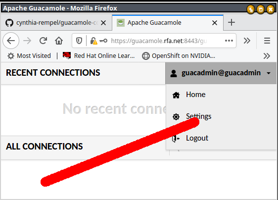
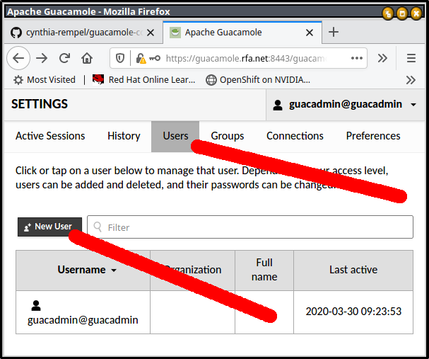
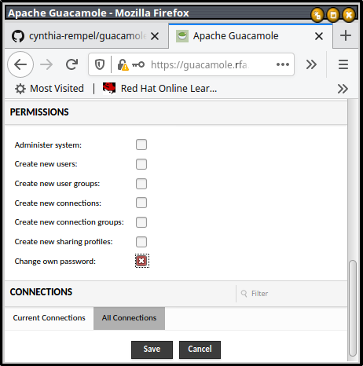
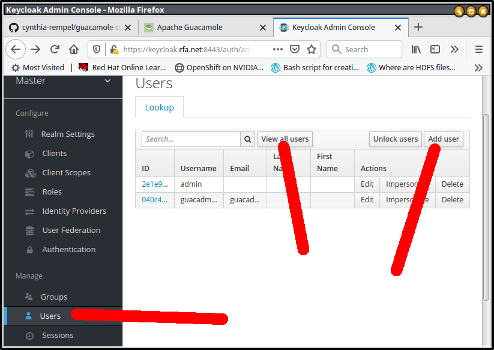
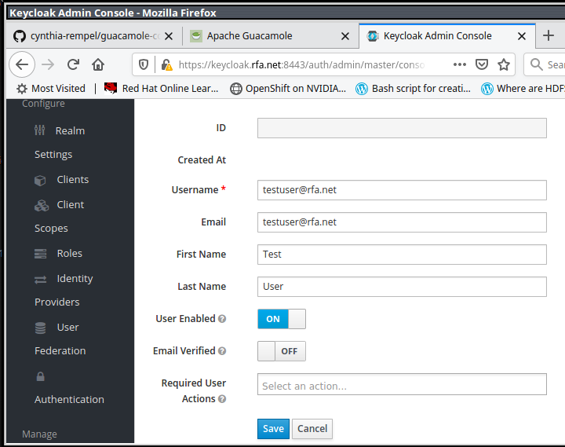
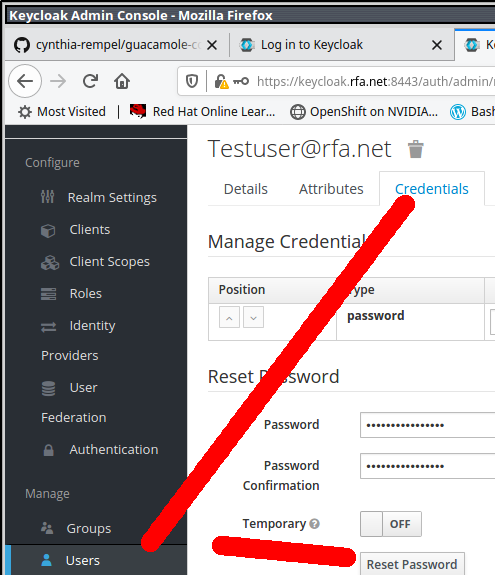

# guacamole-compose
Docker compose project with oeycloak and guacamole

## To get started with no configurations, run 

```
./setup.sh

docker-compose up
```

Requires name resolution to work, so added the following entry to `/etc/hosts`:

```
127.0.1.1 guacamole.rfa.net keycloak.rfa.net
```

### Create the guacadmin user in keycloak

```
# Add the guacadmin user to keycloak with an email
docker exec guacamole-compose_keycloak_1 \
  /opt/jboss/keycloak/bin/kcadm.sh \
  create users \
  -s username=guacadmin@guacadmin \
  -s enabled=true \
  -s email=guacadmin@guacadmin \
  -r master \
  --server https://keycloak.rfa.net:8443/auth \
  --realm master \
  --user admin \
  --password admin

# Set the password
docker exec guacamole-compose_keycloak_1 \
  /opt/jboss/keycloak/bin/kcadm.sh \
  set-password \
  --username guacadmin@guacadmin \
  --new-password guacadmin \
  -r master \
  --server https://keycloak.rfa.net:8443/auth \
  --realm master \
  --user admin \
  --password admin

# Make guacadmin an admin
docker exec guacamole-compose_keycloak_1 \
  /opt/jboss/keycloak/bin/kcadm.sh \
  add-roles \
  --uusername guacadmin@guacadmin \
  --rolename admin \
  -r master \
  --server https://keycloak.rfa.net:8443/auth \
  --realm master \
  --user admin \
  --password admin
```
### Add the guacamole-client

config/keycloak/guacamole-client.json

```
docker exec guacamole-compose_keycloak_1 \
  /opt/jboss/keycloak/bin/kcadm.sh \
  create clients \
  --file guacamole-client.json \
  -r master \
  --server https://keycloak.rfa.net:8443/auth \
  --realm master \
  --user admin \
  --password admin
```

### TODO: add "read-only" role for keycloak

In current configuration all qery and read-roles.

### TODO: make "read-only" role a default role in keycloak

## To customize:

Find all instances of rfa.net, and replace them to you're liking

```
grep -R rfa.net | grep -v Binary
```

**Please note:**  haproxy sni requires *uniq* certs for *each* backend so
you'll need separate certs for guacamole and keycloak

## To use

Then browsed to:

https://guacamole.rfa.net:8443/guacamole

https://keycloak.rfa.net:8443

### To add users

Guacamole uses keycloak for identity, and uses postgres for authorization.
Because of this, users have to be added to both keycloak and postgres.

#### Adding a user to Postgres

https://guacamole.rfa.net:8443/guacamole

username:

guacadmin@guacadmin

password:

guacadmin

*Upper right corner, username, settings*

*Middle top, users, left middle, new user*

*Make sure the username is in email format, make appropriate selections*

*Scroll down, continuing to make appropriate selections, then click save*

#### Adding user to Keycloak

https://keycloak.rfa.net:8443

Administration Console

*Scroll down, click users, view all users, add user*

*Make the keycloak user match the guacamole user*

*Set the password*

## To uninstall

```
docker-compose down
./teardown.sh
```

## Reference:
https://github.com/airaketa/guacamole-docker-compose/tree/5aac1dccbd7b89b54330155270a4684829de1442
https://lemonldap-ng.org/documentation/latest/applications/guacamole
https://guacamole.apache.org/doc/gug/administration.html#connection-management
